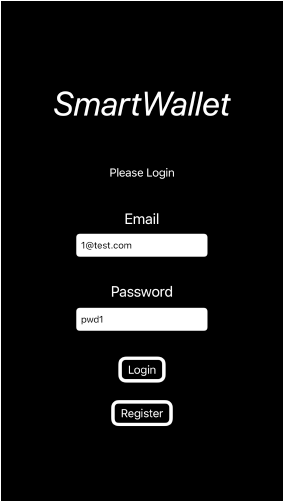
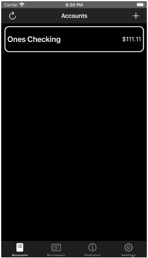
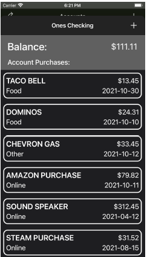
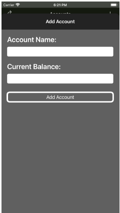
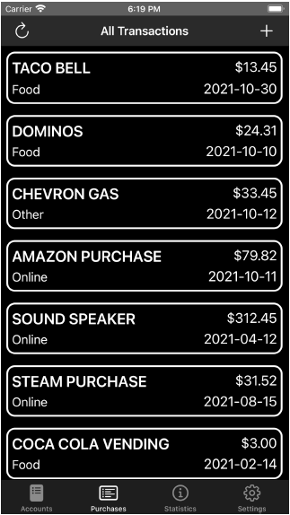
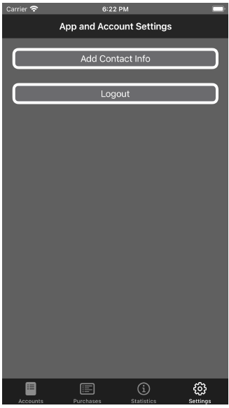
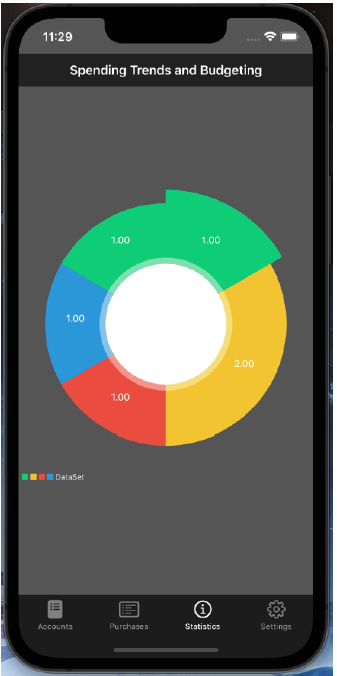

# SmartWallet

SmartWallet is an iOS application that queries an external PostgreSQL server instance using the PostgresClientKit API. It allows users to manage their accounts, transactions, and spending habits.

Link to Demo Video: [https://youtu.be/gNZLuxpytQg](https://youtu.be/gNZLuxpytQg)
 

## Features

* Account management: Users can create, edit, and delete accounts.
* Transaction tracking: SmartWallet tracks all of the user's transactions, regardless of which account they come from.
* Spending analysis: SmartWallet provides a pie chart that shows the user's spending habits by category.

## Requirements

* iOS 15.0 or later
* Xcode 12.5 or later

## Installation

To install SmartWallet, follow these steps:

1. Clone the repository:
2. Navigate to the repository directory:
3. Open the project in Xcode.
4. Build and run the project.

## Usage

To use SmartWallet, follow these steps:

* Create or log in to an account.
* To view your accounts, tap the Accounts tab.
* To view your transactions, tap the Purchases tab.
* To view your spending analysis, tap the Statistics tab.

## Team Members

* Raghav Aggarwal
* Abraham Johnson
* Joshua Mcneil
* Matin Massoudi

## User Manual for SmartWallet:
1. Login pane: On startup, the user will be prompted to either sign in with an existing
account, or create a new one. Each account has an associated email and password that
will be used to log in. To validate user credentials, the app will query the database to see
if the credentials match. Press the Register button on this page to be taken to a page to
create an account.

2. Register pane: After pressing the Register button from the login pane, a user is taken to
this page, where they can sign up for an account. Upon clicking register, the app will run
an INSERT on the database to add new credentials to the database.

3. Home view: After logging in, the user is redirected to a tab view, where they can toggle
between the following view panes:

1. Accounts: All of the users accounts added to the app will be displayed on this page. In
the top left corner, the refresh button will update the users accounts (including account
balance). The add button in the top right corner will add an account for the user. Tapping
on an account will open up a page with recent transactions of that account.

* Account page home: 

* Account recent transactions: 

* Add account view: 

2. Purchases: the purchases view contains all transactions for a user, regardless of which
account it comes from. It is similar to the account recent transactions except that it
shows all user transactions.

3. Settings: The user will have option to enter contact info which will be saved to their
account. The user can also log out of their account from this page to return to the login
screen.

* Settings view: 

* Add contact info view: 

4. Statistics: Here an overview of spending will be shown in the form of a pie chart.

This view shows how many items were bought in each category. This will help the user to
see their most bought category and help the to decrease their expenses in it. We did this because
things like rent and car bills are the highest ones and cant be decreased but that hides small
payment categories that can be.